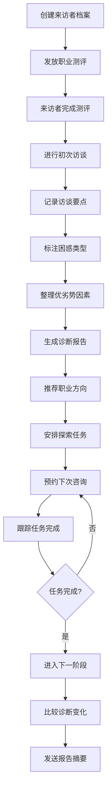

# 职业诊断 Web 应用产品需求文档

## 1. 产品概述

职业诊断 Web 应用是专为职业咨询师设计的专业化评估与管理平台，旨在帮助咨询师对来访者进行结构化的职业评估、跟踪咨询进度、管理咨询流程。

**核心价值：**
- 提升咨询师的工作效率，实现来访者全生命周期管理
- 支持结构化评估流程，确保咨询服务的专业性和一致性
- 提供可视化跟踪工具，便于监控来访者进展

---

## 2. 核心功能

### 2.1 用户角色

| 角色 | 描述 | 核心权限 |
|------|------|---------|
| 咨询师 | 系统主要使用者 | 管理来访者档案、发放测评、记录访谈、生成报告、跟踪方案 |
| 来访者 | 外部用户 | 接收测评链接、查看报告摘要、完成探索任务 |

### 2.2 功能模块

#### 2.2.1 来访者档案
- **档案创建**：咨询师可创建新来访者档案，包含基本信息、联系方式、咨询背景
- **档案管理**：查看、编辑、归档来访者档案
- **档案搜索**：支持按姓名、日期、状态搜索

#### 2.2.2 测评中心
- **测评管理**：管理职业测评量表库（如霍兰德职业兴趣测试、MBTI等）
- **发放测评**：选择测评量表，生成测评链接发送给来访者
- **结果查看**：查看来访者完成的测评得分和详细报告
- **历史对比**：比较来访者多次测评的结果变化

#### 2.2.3 访谈记录
- **访谈记录**：记录每次访谈的要点、发现、进展
- **困惑标注**：标注来访者职业困惑类型（职业定位、转型、发展瓶颈等）
- **优势与限制因素**：整理来访者的职业优势和限制因素

#### 2.2.4 诊断报告
- **报告生成**：基于测评结果和访谈记录，生成结构化诊断报告
- **报告编辑**：支持在线编辑报告内容
- **职业推荐**：推荐适合的职业方向
- **发送摘要**：向来访者发送报告摘要

#### 2.2.5 方案跟踪
- **任务安排**：安排探索任务和后续行动项
- **任务跟踪**：跟踪任务完成情况，设置提醒
- **进度可视化**：查看来访者整体进展

#### 2.2.6 预约管理
- **预约日历**：查看和管理预约日程
- **预约安排**：创建、修改、取消来访者预约
- **下次咨询安排**：在报告中直接安排下次咨询时间

#### 2.2.7 看板视图
- **待跟进名单**：以看板形式展示所有需要跟进来访者
- **状态分类**：按咨询阶段（初始评估、测评中、访谈中、报告撰写、跟进中）分组
- **快速操作**：支持快速标记、电话联系等快捷操作

---

## 3. 核心流程

### 3.1 咨询工作流程

### 3.2 看板管理流程

---

## 4. 用户界面设计

### 4.1 设计风格

**视觉定位：专业、温暖、可信赖**

- **主色调**：深蓝色 `#1e3a5f`（专业、稳重）
- **辅助色**：暖橙色 `#f5a623`（温暖、关怀）
- **背景色**：浅灰 `#f8f9fa` + 白色 `#ffffff`
- **强调色**：青绿色 `#10b981`（成功、进展）
- **警示色**：珊瑚红 `#ef4444`（提醒、待处理）

**设计语言：**
- 采用卡片式布局，清晰区分不同功能模块
- 圆润的按钮和输入框，传达亲和感
- 使用图标系统（Lucide Icons）增强可识别性
- 精心设计的阴影和圆角，营造层次感

**字体选择：**
- 标题字体：Noto Sans SC（中文）/ Inter（英文）
- 正文字体：Source Han Sans CN（中文）/ Inter（英文）
- 数据字体：JetBrains Mono（数字和代码）

### 4.2 页面设计

#### 4.2.1 仪表盘/首页
| 模块 | UI 元素 |
|------|---------|
| 统计概览 | 卡片组：本周咨询数、待跟进人数、进行中任务、预约数 |
| 看板视图 | 拖拽式看板，5列布局（初始评估/测评中/访谈中/报告撰写/跟进中） |
| 今日预约 | 日历视图，显示今日预约列表 |
| 快捷操作 | 新建档案、发放测评、记录访谈按钮 |

#### 4.2.2 来访者档案页
| 模块 | UI 元素 |
|------|---------|
| 档案列表 | 搜索栏 + 筛选器 + 卡片列表 |
| 档案卡片 | 头像、姓名、年龄、最近咨询日期、当前阶段标签 |
| 新建档案 | 模态表单：基本信息、联系方式、咨询背景 |

#### 4.2.3 测评中心页
| 模块 | UI 元素 |
|------|---------|
| 测评量表库 | 卡片网格展示可用测评 |
| 已发放测评 | 表格视图：来访者姓名、测评名称、发放日期、状态、完成日期 |
| 测评结果 | 雷达图、柱状图、详细解读面板 |
| 历史对比 | 折线图展示多次测评变化 |

#### 4.2.4 访谈记录页
| 模块 | UI 元素 |
|------|---------|
| 访谈列表 | 时间线视图，按日期排序 |
| 访谈详情 | 富文本编辑器记录要点 |
| 困惑标注 | 标签选择器（职业定位/转型困惑/发展瓶颈/能力提升/薪资期望/人际关系） |
| 优劣势整理 | 双栏布局：优势（绿色）/限制因素（橙色） |

#### 4.2.5 诊断报告页
| 模块 | UI 元素 |
|------|---------|
| 报告编辑器 | 富文本编辑器，支持拖拽模块 |
| 职业推荐 | 职业卡片列表，可拖拽排序 |
| 报告预览 | 打印友好视图 |
| 发送摘要 | 邮件/短信发送表单 |

#### 4.2.6 方案跟踪页
| 模块 | UI 元素 |
|------|---------|
| 任务看板 | 看板视图：待开始/进行中/已完成 |
| 任务详情 | 任务描述、截止日期、提醒设置、完成状态 |
| 进度图表 | 环形进度图、柱状图 |

#### 4.2.7 预约管理页
| 模块 | UI 元素 |
|------|---------|
| 日历视图 | 月/周/日视图切换 |
| 预约列表 | 侧边栏列表，显示当天预约 |
| 新建预约 | 模态表单：选择来访者、时间、时长、咨询方式 |

---

## 5. 响应式设计

- **桌面端优先**（1200px+）：完整功能展示
- **平板适配**（768px-1199px）：侧边栏折叠，卡片自适应
- **移动端**（<768px）：简化导航，重要功能优先展示

---

## 6. 页面清单

| 页面名称 | 路由 | 核心模块 |
|---------|------|---------|
| 仪表盘 | `/` | 统计概览、看板视图、今日预约、快捷操作 |
| 来访者档案 | `/clients` | 档案列表、新建档案、档案详情 |
| 测评中心 | `/assessments` | 量表库、发放记录、结果查看、历史对比 |
| 访谈记录 | `/interviews` | 访谈列表、访谈详情、困惑标注、优劣势整理 |
| 诊断报告 | `/reports` | 报告编辑、职业推荐、报告预览、发送摘要 |
| 方案跟踪 | `/tracking` | 任务看板、进度图表、任务详情 |
| 预约管理 | `/appointments` | 日历视图、预约列表、新建预约 |
