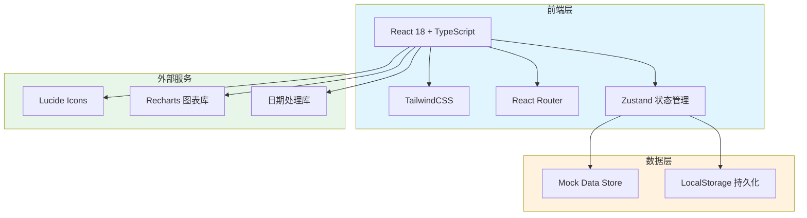

# 职业诊断 Web 应用技术架构文档

## 1. 架构设计

### 1.1 系统架构图



### 1.2 技术选型理由

- **React 18 + TypeScript**：类型安全，组件化开发，便于维护
- **TailwindCSS**：原子化 CSS，快速构建响应式界面
- **Zustand**：轻量级状态管理，简单易用
- **React Router**： SPA 路由管理
- **Recharts**：基于 React 的图表库，支持雷达图、折线图等
- **Lucide Icons**：现代、轻量的图标库
- **Mock Data**：使用本地模拟数据，无需后端服务

---

## 2. 路由定义

| 路由 | 页面名称 | 功能描述 |
|------|---------|---------|
| `/` | 仪表盘 | 首页，包含统计概览、看板视图、今日预约 |
| `/clients` | 来访者档案 | 管理来访者档案列表 |
| `/clients/:id` | 档案详情 | 查看/编辑单个来访者档案 |
| `/clients/new` | 新建档案 | 创建新来访者档案 |
| `/assessments` | 测评中心 | 管理测评量表和发放记录 |
| `/assessments/:id/results` | 测评结果 | 查看测评结果和历史对比 |
| `/interviews` | 访谈记录 | 管理访谈记录 |
| `/interviews/:id` | 访谈详情 | 查看/编辑访谈记录 |
| `/interviews/new` | 新建访谈 | 创建新访谈记录 |
| `/reports` | 诊断报告 | 管理诊断报告 |
| `/reports/:id` | 报告详情 | 查看/编辑诊断报告 |
| `/reports/new` | 新建报告 | 创建新诊断报告 |
| `/tracking` | 方案跟踪 | 跟踪任务和进度 |
| `/appointments` | 预约管理 | 管理预约日程 |

---

## 3. 数据模型

### 3.1 数据模型定义

```mermaid
erDiagram
    CLIENT ||--o{ ASSESSMENT : "完成"
    CLIENT ||--o{ INTERVIEW : "参与"
    CLIENT ||--o{ REPORT : "拥有"
    CLIENT ||--o{ TASK : "分配"
    CLIENT ||--o{ APPOINTMENT : "预约"
    ASSESSMENT ||--o| ASSESSMENT_RESULT : "生成"
    REPORT ||--o{ TASK : "包含"
    REPORT ||--o{ CAREER_RECOMMENDATION : "推荐"
    
    CLIENT {
        string id PK
        string name
        string gender
        int age
        string phone
        string email
        string occupation
        string education
        string consultationBackground
        string currentStage
        date createdAt
        date updatedAt
    }
    
    ASSESSMENT {
        string id PK
        string clientId FK
        string assessmentType
        date sentAt
        date? completedAt
        string status
        string? resultId
    }
    
    ASSESSMENT_RESULT {
        string id PK
        string assessmentId FK
        object scores
        string interpretation
        date createdAt
    }
    
    INTERVIEW {
        string id PK
        string clientId FK
        date interviewDate
        int duration
        string summary
        array confusionTypes
        array strengths
        array limitations
        string nextSteps
        date createdAt
    }
    
    REPORT {
        string id PK
        string clientId FK
        string title
        string content
        array careerRecommendations
        date createdAt
        date updatedAt
        string status
    }
    
    TASK {
        string id PK
        string clientId FK
        string reportId FK
        string title
        string description
        date dueDate
        string status
        date createdAt
    }
    
    APPOINTMENT {
        string id PK
        string clientId FK
        date scheduledAt
        int duration
        string method
        string? notes
        string status
    }
```

### 3.2 核心数据类型

```typescript
// 来访者档案
interface Client {
  id: string;
  name: string;
  gender: 'male' | 'female' | 'other';
  age: number;
  phone: string;
  email: string;
  occupation: string;
  education: string;
  consultationBackground: string;
  currentStage: ClientStage;
  avatar?: string;
  createdAt: Date;
  updatedAt: Date;
}

// 咨询阶段
type ClientStage = 
  | 'initial_assessment'  // 初始评估
  | 'assessment'          // 测评中
  | 'interview'            // 访谈中
  | 'report_writing'       // 报告撰写
  | 'follow_up';          // 跟进中

// 测评记录
interface Assessment {
  id: string;
  clientId: string;
  assessmentType: AssessmentType;
  sentAt: Date;
  completedAt?: Date;
  status: 'pending' | 'completed' | 'expired';
  scores?: AssessmentScores;
}

// 职业困惑类型
type ConfusionType = 
  | 'career_positioning'   // 职业定位
  | 'career_transition'    // 职业转型
  | 'development_bottleneck' // 发展瓶颈
  | 'skill_improvement'    // 能力提升
  | 'salary_expectation'   // 薪资期望
  | 'workplace_relationship'; // 人际关系

// 访谈记录
interface Interview {
  id: string;
  clientId: string;
  interviewDate: Date;
  duration: number;
  summary: string;
  confusionTypes: ConfusionType[];
  strengths: string[];
  limitations: string[];
  nextSteps: string;
}

// 诊断报告
interface Report {
  id: string;
  clientId: string;
  title: string;
  content: string;
  careerRecommendations: CareerRecommendation[];
  status: 'draft' | 'completed' | 'sent';
  createdAt: Date;
  updatedAt: Date;
}

// 职业推荐
interface CareerRecommendation {
  id: string;
  careerName: string;
  matchScore: number;
  reason: string;
  explorationTasks: string[];
}

// 探索任务
interface Task {
  id: string;
  clientId: string;
  reportId: string;
  title: string;
  description: string;
  dueDate: Date;
  status: 'todo' | 'in_progress' | 'completed';
}

// 预约
interface Appointment {
  id: string;
  clientId: string;
  scheduledAt: Date;
  duration: number;
  method: 'offline' | 'online';
  notes?: string;
  status: 'scheduled' | 'completed' | 'cancelled';
}
```

---

## 4. 组件结构

### 4.1 目录结构

```
src/
├── components/
│   ├── common/          // 通用组件
│   │   ├── Button.tsx
│   │   ├── Card.tsx
│   │   ├── Modal.tsx
│   │   ├── Input.tsx
│   │   ├── Select.tsx
│   │   ├── Badge.tsx
│   │   ├── Avatar.tsx
│   │   ├── Calendar.tsx
│   │   └── Table.tsx
│   ├── layout/          // 布局组件
│   │   ├── Sidebar.tsx
│   │   ├── Header.tsx
│   │   └── Layout.tsx
│   ├── dashboard/       // 仪表盘组件
│   │   ├── StatsCard.tsx
│   │   ├── KanbanBoard.tsx
│   │   ├── KanbanColumn.tsx
│   │   └── TodayAppointments.tsx
│   ├── client/          // 来访者组件
│   │   ├── ClientCard.tsx
│   │   ├── ClientForm.tsx
│   │   └── ClientList.tsx
│   ├── assessment/      // 测评组件
│   │   ├── AssessmentCard.tsx
│   │   ├── AssessmentResult.tsx
│   │   └── RadarChart.tsx
│   ├── interview/       // 访谈组件
│   │   ├── InterviewCard.tsx
│   │   ├── ConfusionTags.tsx
│   │   └── StrengthWeakness.tsx
│   ├── report/           // 报告组件
│   │   ├── ReportEditor.tsx
│   │   ├── CareerRecommend.tsx
│   │   └── ReportPreview.tsx
│   └── tracking/         // 跟踪组件
│       ├── TaskCard.tsx
│       └── ProgressChart.tsx
├── pages/
│   ├── Dashboard.tsx
│   ├── Clients.tsx
│   ├── ClientDetail.tsx
│   ├── Assessments.tsx
│   ├── AssessmentResults.tsx
│   ├── Interviews.tsx
│   ├── InterviewDetail.tsx
│   ├── Reports.tsx
│   ├── ReportDetail.tsx
│   ├── Tracking.tsx
│   └── Appointments.tsx
├── store/
│   ├── useClientStore.ts
│   ├── useAssessmentStore.ts
│   ├── useInterviewStore.ts
│   ├── useReportStore.ts
│   ├── useTaskStore.ts
│   └── useAppointmentStore.ts
├── hooks/
│   ├── useClients.ts
│   ├── useAssessments.ts
│   └── useAppointments.ts
├── utils/
│   ├── mockData.ts
│   └── helpers.ts
├── types/
│   └── index.ts
├── App.tsx
├── main.tsx
└── index.css
```

---

## 5. 状态管理

使用 Zustand 进行状态管理，每个功能模块有独立 store：

```typescript
// 状态管理结构示例
const useClientStore = create<ClientState>((set) => ({
  clients: [],
  currentClient: null,
  loading: false,
  
  // Actions
  fetchClients: async () => { ... },
  addClient: async (client) => { ... },
  updateClient: async (id, data) => { ... },
  deleteClient: async (id) => { ... },
}));
```

---

## 6. Mock 数据策略

- 使用本地 JSON 文件存储模拟数据
- LocalStorage 用于数据持久化
- 初始化时加载预设数据
- 支持数据的增删改查操作

---

## 7. 关键实现要点

### 7.1 看板功能
- 使用 React DnD 或自定义拖拽实现
- 支持跨列拖拽更新状态
- 实时保存拖拽结果

### 7.2 图表展示
- 雷达图：展示多维度测评结果
- 折线图：展示历史测评变化
- 环形图：展示任务完成进度

### 7.3 日历视图
- 使用自定义日历组件
- 支持月/周/日视图切换
- 点击日期显示预约详情

### 7.4 富文本编辑
- 使用 React-Quill 或 TipTap
- 支持基本格式：标题、列表、加粗、斜体
- 支持插入职业推荐模块
